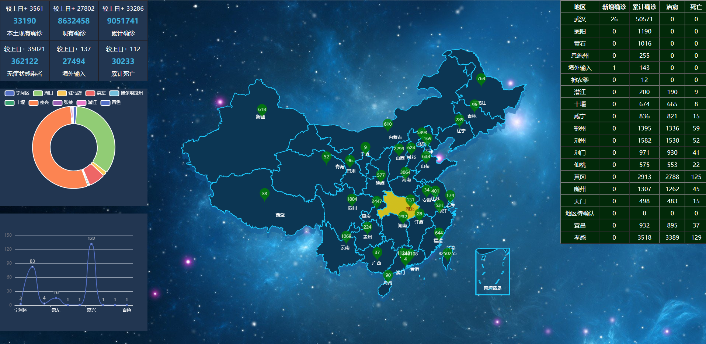

# 仿疫情地图，Vue3 + vite + pinia + echarts + animate + TS 实现数据可视化

# 因疫情数据接口停用，所以用的假数据实现

# 效果图


# 需要下载的插件
```sh
npm install echarts
```

```sh
npm install animate.css -S
```


## Project Setup

```sh
npm install
```

### Compile and Hot-Reload for Development

```sh
npm run dev
```

### Type-Check, Compile and Minify for Production

```sh
npm run build
```
